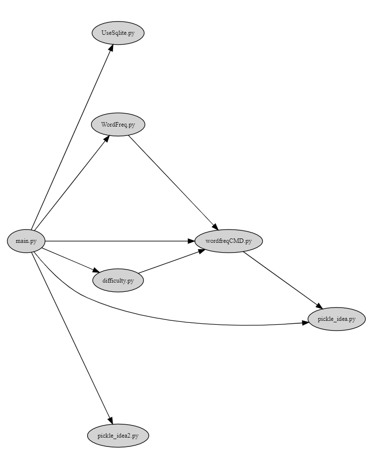
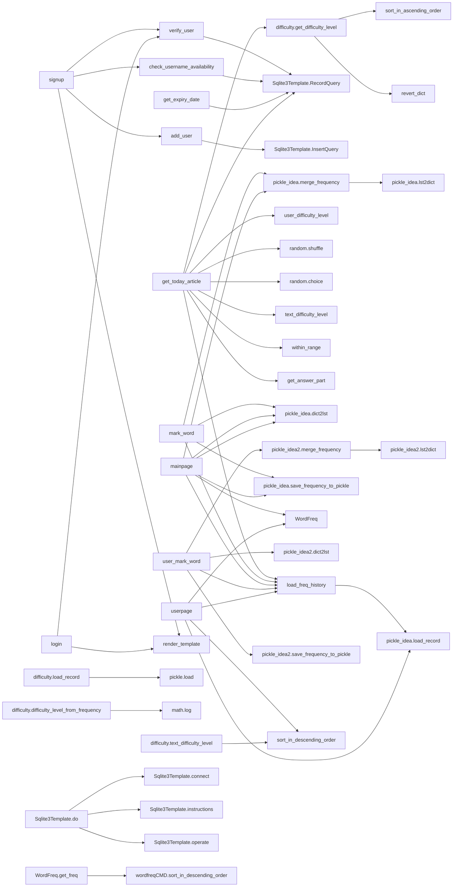

# EnglishPal Dependency Analysis and Dependency Graph

Author: 占健豪, 王彦超, 陈致远, 汤佳伟

Date: 2021/5/17

Location: 22-206

<div STYLE="page-break-after: always;"></div>

## Introduction

EnglishPal is a website application dedicated to helping people improve their English. This lab study help us understand the current health level of the architecture of EnglishPal.

## Materials and Methods

The module-level dependencies are captured by snakefood, and the class/function-level dependency graph for EnglilshPal is hand-drawn and can be plotted by Mermaid.

## Results

1. EnglishPalModule.dot:

``` linenums="1"
strict digraph "dependencies" {
    graph [
           rankdir="LR",
           overlap="scale",
           size="8,10",
           ratio="fill",
           fontsize="16",
           fontname="Helvetica",
           clusterrank="local"
        ]
       node [
           fontsize=10
           shape=ellipse
           // style=filled
           // shape=box
       ];
   
"UseSqlite.py"  [style=filled];
"WordFreq.py"  [style=filled];
"WordFreq.py" -> "wordfreqCMD.py";
"difficulty.py"  [style=filled];
"difficulty.py" -> "wordfreqCMD.py";
"main.py"  [style=filled];
"main.py" -> "UseSqlite.py";
"main.py" -> "WordFreq.py";
"main.py" -> "difficulty.py";
"main.py" -> "pickle_idea.py";
"main.py" -> "pickle_idea2.py";
"main.py" -> "wordfreqCMD.py";
"pickle_idea.py"  [style=filled];
"pickle_idea2.py"  [style=filled];
"wordfreqCMD.py"  [style=filled];
"wordfreqCMD.py" -> "pickle_idea.py";
}
```
   
2. class/function-level.txt



   
3. Pros and cons of the current architecture of EnglishPal:
   
   Shortcoming:

   1. The addition of the web pages makes the system inefficient to deliver media elements.
   2. All the processing tasks are done by the server before the delivery of the content to the client. The server inefficient to handle multiple user requests.
   3. Any development change or maintenance costs a lot.

   Advantages:

   1. Efficient with full-stack, no communication costs between front-end and back-end.
   2. Effective for simple and small projects, with simple CRUD and smaller codebase, it's more enough.
   3. Higher security, protecting the API from attack.
   4. Similar concept and syntax, it helps focusing on project features.
   5. It reduces the mistakes in communications.

## Discussions

Through this lab we tried to understand the current health level of the architecture of EnglishPal. During the lab, we learnt to use Snakefood, Graphviz Online, Mermaid as well as Read the Docs. Most importantly, we mastered a basic work flow of analysing the structure and the dependency of an existing project which will sure to contribute to the future work.


## References

Graphviz. [https://graphviz.org/](https://graphviz.org/)

Graphviz Online. [https://bit.ly/3uYDiLV](https://bit.ly/3uYDiLV)

Read the Docs. [https://readthedocs.org/](https://readthedocs.org/)

Snakefood: Python Dependency Graphs. [http://furius.ca/snakefood/](http://furius.ca/snakefood/)

Mermaid. [https://mermaid-js.github.io/mermaid/#/](https://mermaid-js.github.io/mermaid/#/)

Jacopo Malnati. X-Ray 1.0.4.1, my Bachelor and Research Project. [https://xray.inf.usi.ch/xray.php](https://xray.inf.usi.ch/xray.php)

Sofia Peterson. A Brief Guide How to Write a Computer Science Lab Report. [https://thehackpost.com/a-brief-guide-how-to-write-a-computer-science-lab-report.html](https://thehackpost.com/a-brief-guide-how-to-write-a-computer-science-lab-report.html)

[lab1.pdf.](http://lanlab.org/course/2021s/softarch/Lab1.pdf)

