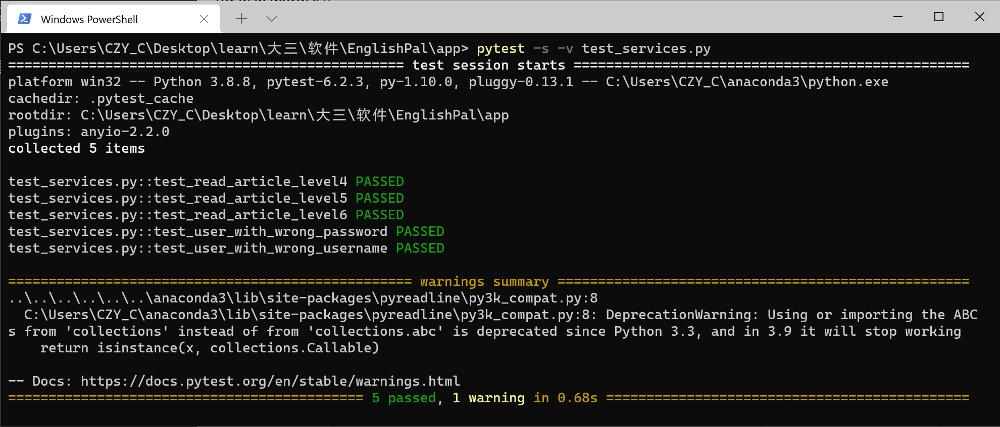

# Lab 3 - The Service Layer

Author: 占健豪, 王彦超, 陈致远, 汤佳伟

Date: 2021/6/7

Location: 22-206

<div STYLE="page-break-after: always;"></div>

## Introduction

This lab is a follow-up to Lab 2. In this lab, we are going to implement a service layer in services.py for EnglishPal, which provides a core service called read. This service would choose a suitable article for a user to read. The function read takes as input the following four arguments and returns an article ID if the user has been successfully assigned with an article to read.

The function read(user, user repo, article repo, session) raises an UnknownUser exception if user does not have a correct user name or a correct password, or raises a NoArticleMatched exception if no article in the article repository, i.e., article repo, has a difficulty level matching the user’s vocabulary level. We say that an article’s difficulty level, La, matches a user’s vocabulary level, Lu, if La > Lu. If more than one article satisfies La > Lu, then the one with the smallest La is chosen.

> - user: a User object. The class User is defined in model.py.
> - user repo: a UserRepository object. The class UserRepository is defined in repository.py.
> -  article repo: an ArticleRepository object. The class ArticleRepository is defined in repository.py.
> - session: an SQLAlchemy session object.

## Materials and Methods

### Work flow

> 1. Review and analyze the requirements in lab3.pdf.
> 2. Learn about the relative knowledges with service layer and data layer.
> 3. Start with code.
> 4. Search for the coding techniques required online.
> 5. Finish the coding process.
> 6. Summarize and Write the document.

<div STYLE="page-break-after: always;"></div>

### Source Codes

Modified service.py: // Modified part with code highlight

``` python  linenums="1" hl_lines="18-46"
# Software Architecture and Design Patterns -- Lab 3 starter code
# An implementation of the Service Layer
# Copyright (C) 2021 Hui Lan

import repository
import model

# word and its difficulty level
WORD_DIFFICULTY_LEVEL = {'starbucks':5, 'luckin':4, 'secondcup':4, 'costa':3, 'timhortons':3, 'frappuccino':6}

class UnknownUser(Exception):
    pass

class NoArticleMatched(Exception):
    pass

def read(user, user_repo, article_repo, session):

    dbuser = user_repo.get(user.username)
    if dbuser is None or dbuser.password != user.password:
        raise UnknownUser(user)

    wordList = session.query(model.NewWord).filter(model.NewWord.username == user.username).all()
    difficulty_list = []
    for w in wordList:
        difficulty_list.append(WORD_DIFFICULTY_LEVEL.get(w.word))
    difficulty_list.sort(reverse=True)
    lu = 0
    count = 0
    for i in difficulty_list:
        if count>=3:
            break
        lu += i
        count+=1
    lu /= count

    qualified_articles = session.query(model.Article).filter(model.Article.level > lu).order_by(model.Article.level).all()
    if not qualified_articles:
        raise NoArticleMatched
    else:
        wanted_article = qualified_articles[0]
        ar = article_repo.get(wanted_article.article_id)
        session.add(ar)
        dbuser.read_article(ar)
        session.commit()
        return wanted_article.article_id
```

## Results



## Discussions

- For this lab we learnt about the service layer, and how it work with databases.
- We tried to understand dependency inversion.
- Also, we learnt to use github page combining with mkdocs to manage our lab report and deploy it to webpages - [https://stellafull.github.io/EnglishPal/lab3/](https://stellafull.github.io/EnglishPal/lab3/).

## References

[lab3.pdf](http://lanlab.org/course/2021s/softarch/lab3/Lab3.pdf)